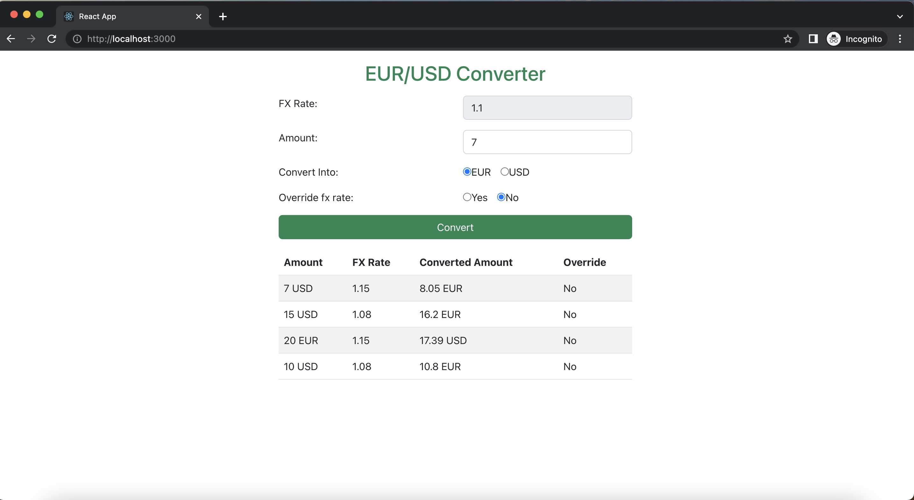

## To Run Project

In the project directory, you can run:
### `npm install`
Installs all the dependencies.

### `npm start`

Runs the app in the development mode.\
Open [http://localhost:3000](http://localhost:3000) to view it in your browser.

## Tech Stack

**Client:** React, Bootstrap

## Screenshots

